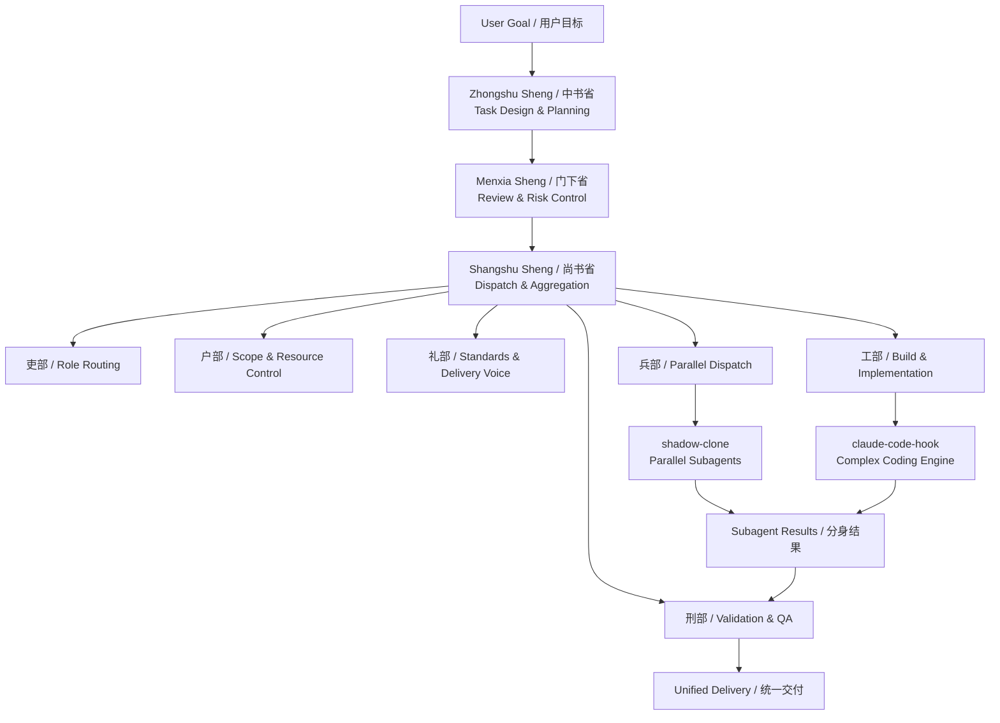
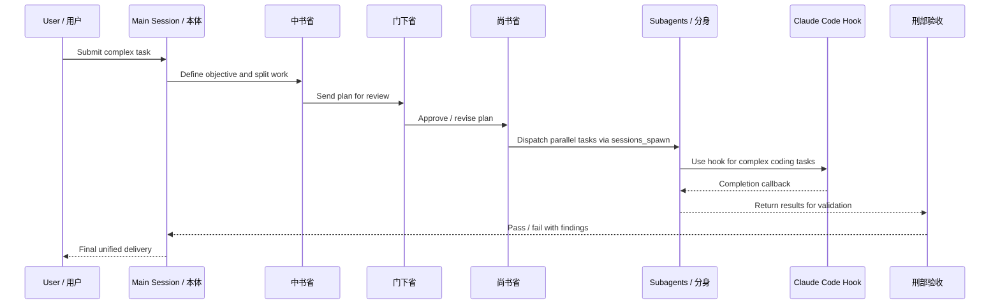

# Cyber Emperor / 赛博皇帝

> **Build a digital court for complex AI work.**  
> **不是多开几个 Agent，而是为复杂任务建立一套真正可治理、可并行、可验收、可交付的数字朝廷。**

`cyber-emperor` is a high-level OpenClaw skill for orchestrating complex tasks through a governance-first multi-agent model inspired by the traditional **Three Departments and Six Ministries** system.

`cyber-emperor` 是一个面向 OpenClaw 的高阶编排型 skill。它把“三省六部”的治理思路，翻译成现代 AI 协作系统里的 **任务拆解、角色分工、风险审查、并行执行、统一验收与最终交付**。

It is designed for work that is too large, too cross-functional, or too risky to be handled as a loose pile of prompts.

它特别适合那些**已经不能靠“一个 Agent 硬扛到底”**的任务：复杂、跨模块、跨阶段、需要多人协同、需要明确质量闸门的工作。

---

## What makes it different / 它和普通多 Agent 有什么不同？

Most multi-agent systems fail not because they lack intelligence, but because they lack structure.

很多多 Agent 系统失败，不是因为 Agent 不够聪明，而是因为**没有组织能力**。

Typical problems:

- too many agents, unclear roles
- parallel execution without boundaries
- outputs that look busy but cannot be delivered
- no validation layer, no ownership, no closeout
- the main session keeps jumping in to patch chaos

典型问题包括：

- Agent 一多，职责立刻混乱
- 并行推进没有边界，互相踩文件、踩结论
- 输出看着热闹，实际上不可交付
- 没有验收层，也没有统一收口的人
- 本体一边说“协作”，一边还得亲自补锅

`cyber-emperor` solves this by turning complex work into a disciplined operating model.

`cyber-emperor` 的目标，就是把复杂任务从“很多人一起做”，升级成“有秩序地协同作战”。

---

## Core Positioning / 核心定位

`cyber-emperor` is **not** just a way to spawn more subagents.

它**不是**“多开几个分身”的花哨说法。

It is a governance and orchestration framework that answers:

- Why should this task be split?
- What roles should exist?
- What can run in parallel?
- What must be reviewed?
- When should complex coding use `claude-code-hook`?
- Who validates the output and who delivers the final result?

它真正解决的是：

- 为什么这个任务要拆？
- 拆成哪些角色最合理？
- 哪些可以并行，哪些必须审批？
- 复杂编码什么时候必须接入 `claude-code-hook`？
- 最终谁来验收？谁来交付？谁来收口？

### Relationship with other OpenClaw capabilities / 与其他能力的关系

- **`cyber-emperor`** — governance, orchestration, risk control, closeout
- **`shadow-clone`** — parallel subagent execution
- **`claude-code-hook`** — zero-polling complex coding execution

也就是说：

- **赛博皇帝**：定朝纲、拆任务、控风险、做收口
- **影分身**：负责布阵与并行执行
- **Claude Code Hook**：负责工部级复杂建设

Together, they form a serious multi-agent production workflow instead of a noisy swarm.

三者结合起来，才是一套真正能打项目战的多 Agent 工作流。

---

## Governance Model / 治理模型

### Three Departments / 三省

#### Zhongshu Sheng / 中书省
Planning, goal interpretation, and task decomposition.  
负责目标解析、任务拆解、依赖设计、完成标准起草。

#### Menxia Sheng / 门下省
Review, correction, and risk control.  
负责方案复核、风险识别、冲突检查、可交付性判断。

#### Shangshu Sheng / 尚书省
Dispatch, aggregation, and closeout.  
负责派发任务、汇总阶段成果、组织验收、完成交付收口。

### Six Ministries / 六部

#### Ministry of Personnel / 吏部
Role assignment and capability routing.  
角色匹配、能力路由、决定由谁来做。

#### Ministry of Revenue / 户部
Scope, context, and resource boundaries.  
控制文件范围、上下文范围、时间预算与成本边界。

#### Ministry of Rites / 礼部
Standards, structure, and output voice.  
统一文档结构、汇报格式、术语口径与交付表达。

#### Ministry of War / 兵部
Parallel execution and formation design.  
负责影分身阵型设计、并行推进与失败重组。

#### Ministry of Justice / 刑部
Validation, QA, and risk review.  
负责 type-check、build、test、风险判断与交付门禁。

#### Ministry of Works / 工部
Implementation and artifact creation.  
负责编码、搭建、修改结构、完善文档，产出真正的成果。

---

## Cyber Emperor Architecture / 赛博皇帝架构图

### High-Level Architecture / 高层架构图

### Execution Flow / 执行流程图

### Design Summary / 设计摘要

- `cyber-emperor` is the governance layer / `cyber-emperor` 是治理层
- `shadow-clone` is the parallel execution layer / `shadow-clone` 是并行执行层
- `claude-code-hook` is the complex coding layer / `claude-code-hook` 是复杂编码执行层
- final output must be reviewed and unified / 最终结果必须经过验收并统一交付

---

## What it is good at / 它擅长处理什么任务？

Use `cyber-emperor` when the work requires structure instead of brute force.

当任务已经不是“直接做完”，而是“需要一套协作秩序”时，就该用它。

### Good fit / 适合场景

- medium to large project work / 中大型项目任务
- multi-module implementation / 多模块并行改造
- planning → implementation → testing → docs → delivery workflows / 分析→实现→测试→文档→交付链路
- complex coding and refactors / 复杂编码与重构
- unified delivery after parallel execution / 并行完成后的统一交付

### Not a good fit / 不适合场景

- tiny edits / 小修小补
- pure Q&A / 纯查询
- one-file fixes / 单文件改动
- work that is faster to do directly / 直接做反而更快的任务

In short: do not deploy an empire to solve a paper cut.

一句话：**别为了显得高级，就把小事硬升级成满朝文武齐上阵。**

---

## Why it feels powerful / 为什么它会显得很强？

Because it does not only provide a prompt. It provides an operating system for collaboration.

因为它给你的不是一句提示词，而是一整套协作操作系统。

It provides:

- a governance model / 治理模型
- a task decomposition model / 拆解模型
- a role and responsibility model / 分工模型
- a parallel execution model / 并行模型
- a validation model / 验收模型
- a delivery model / 交付模型

That is why it feels larger, sharper, and more project-ready than ordinary multi-agent recipes.

所以它看起来不是“一个技能”，而更像一套真正能拿来带项目、带交付、带复杂协作的工作流框架。

---

## Repository Structure / 仓库结构

- `README.md` — bilingual landing page / 中英双语入口
- `README.zh-CN.md` — Chinese overview / 中文豪华说明
- `README.en.md` — English overview / 英文说明
- `LICENSE.md` — Custom Non-Commercial License / 自定义非商业许可
- `skills/cyber-emperor/SKILL.md` — main skill definition / 技能主文档
- `skills/cyber-emperor/README.md` — short companion overview / skill 辅助说明

## License / 许可说明

This repository is released under a **Custom Non-Commercial License**. You may view, study, copy, and modify the contents for personal, educational, research, and other non-commercial purposes. **Commercial use, commercial distribution, and use in paid products or services require prior written authorization.** See [LICENSE.md](./LICENSE.md).

本仓库采用 **Custom Non-Commercial License（自定义非商业许可）**。你可以出于个人、学习、研究及其他非商业目的查看、学习、复制与修改本仓库内容。**任何商业使用、商业分发，以及在收费产品或服务中的使用，均须事先取得书面授权。** 详见 [LICENSE.md](./LICENSE.md)。

---

## Highlights / 特点

- Three-layer governance and execution model / 三层治理与执行模型
- Governance-first multi-agent orchestration / 先治理、后并行的多 Agent 编排
- Designed to work with `sessions_spawn`, `shadow-clone`, and `claude-code-hook`
- Practical templates, boundaries, and delivery rules / 有模板、有边界、有验收、有交付规范
- Suitable for large tasks, risky changes, and project-level delivery / 适合复杂任务、风险任务、项目级推进

---

## Public Publishing Rule / 公开发布铁律

This public repository must not contain any secrets, tokens, passwords, private keys, cookies, sessions, or other credentials.

本公开仓库不得包含任何密钥、令牌、密码、私钥、Cookie、Session 或其他凭据。

Share methods, not keys.  
公开 skill，发方法，不发钥匙。

---

## Future Expansion / 后续扩展方向

This repository can grow into a broader public skill system with:

- more reusable skills / 更多可复用 skill
- task templates / 任务模板
- diagrams and demos / 架构图与演示材料
- changelogs / 发布日志
- cross-skill collaboration patterns / 多 skill 协同案例

它未来可以扩展成一个更完整的公开 skill 体系，而 `cyber-emperor` 会是那个体系里最有统御感的一块底座。
