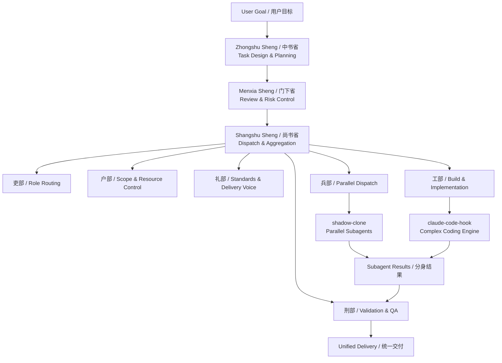
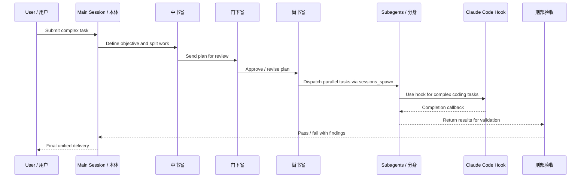

# Cyber Emperor Architecture / 赛博皇帝架构图

## High-Level Architecture

## Execution Flow

## Design Summary

- `cyber-emperor` is the governance layer
- `shadow-clone` is the parallel execution layer
- `claude-code-hook` is the complex coding execution layer
- Final delivery is always unified, reviewed, and structured

## 中文说明

- `cyber-emperor` 负责治理、编排、控风险、收口
- `shadow-clone` 负责并行派发分身
- `claude-code-hook` 负责复杂编码零轮询执行
- 最终结果必须经过验收并统一交付，而不是拼盘式输出
